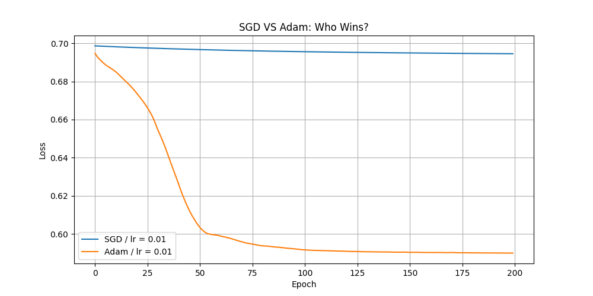

# SGD-vs-Adam-comparison-on-Moons-Circles-dataset
# Optimizer Analysis: SGD vs. Adam

This repository contains a technical evaluation of optimization algorithms within Deep Learning, specifically comparing **Stochastic Gradient Descent (SGD)** and **Adam**. The analysis uses a Multi-Layer Perceptron (MLP) built with PyTorch to classify non-linear datasets (Moons/Circles).

## 📊 Performance Metrics
The models were trained for 200 epochs with a learning rate of 0.01. The results demonstrate the efficiency of adaptive learning rates:

| Optimizer | Final Loss | Observations |
| :--- | :--- | :--- |
| **Adam** | **0.1252** | High convergence speed; successfully modeled non-linear boundaries. |
| **SGD** | **0.6991** | Stuck in a local plateau; requires momentum or scheduling to progress. |

### Convergence Visualization


## 🧠 Technical Overview
- **Adaptive Estimation:** The Adam optimizer outperformed SGD by adjusting the learning rate for each parameter individually based on first and second moments of the gradients.
- **Architecture:** The MLP consists of hidden layers designed to handle the non-linear distribution of the Moons and Circles datasets.

## 🛠️ Installation & Usage
Ensure you have the following dependencies:
```bash
pip install torch matplotlib scikit-learn numpy
